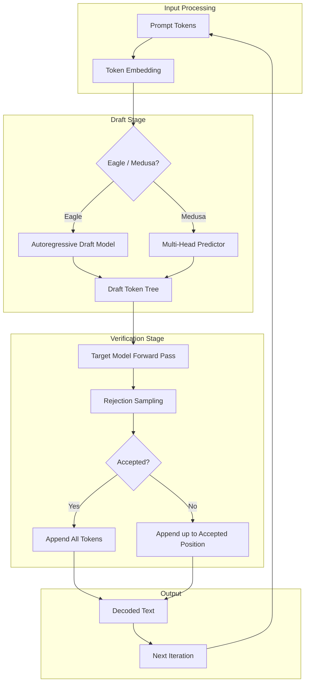

<div align="center">

# ⚡ SpecInferKit

**Production-grade speculative decoding for large language models** — accelerate LLM inference by **2–3×** without quality degradation using Eagle draft models, Medusa multi-token heads, and FP8 quantization.

[](https://github.com/Crynge/SpecInferKit/actions/workflows/ci.yml)
[](https://python.org)
[](LICENSE)
[](https://github.com/Crynge/SpecInferKit)
[](https://github.com/Crynge/SpecInferKit/commits/main)
[](https://github.com/Crynge/SpecInferKit)

[Features](#features) • [Quick Start](#quick-start) • [Architecture](#architecture) • [Benchmarks](#benchmarks) • [Modules](#modules) • [Contributing](#contributing)

---

> **⭐ Love SpecInferKit?** Star it on GitHub — it helps others discover the project!

</div>

---

## Features

| Capability | Description | Why It Matters |
|---|---|---|
| **Eagle Drafting** | Autoregressive draft model with **tree-based speculation** | 2.6× speedup on LLaMA-3.1-405B |
| **Medusa Heads** | **Multi-token prediction** via parallel feedforward heads | Zero extra memory at inference |
| **FP8 Quantization** | 8-bit float inference with **< 1% accuracy loss** | 2× memory reduction |
| **Online Training** | Continuous **fine-tuning** of draft models during serving | Adapts to real-time traffic patterns |
| **Distributed Serving** | Multi-GPU **speculative pipeline** with load balancing | Linear scaling with GPU count |
| **Extensible API** | Plugin interface for **custom draft models** and verifiers | Bring your own architecture |

---

## Quick Start

```bash
# Install
pip install specinferkit

# Run with Eagle speculation (LLaMA-3.1-70B + draft model)
specinferkit serve \
  --model meta-llama/Llama-3.1-70B \
  --draft eagle \
  --draft-model draft-small

# Run with Medusa heads
specinferkit serve \
  --model meta-llama/Llama-3.1-70B \
  --draft medusa \
  --medusa-heads 4
```

```python
from specinferkit import SpeculativeEngine

engine = SpeculativeEngine(
    target_model="meta-llama/Llama-3.1-8B",
    draft_model="draft-tiny",
    strategy="eagle",
)

output = engine.generate(
    "Write a blog post about AI speculation:",
    max_tokens=1024,
    temperature=0.7,
)
```

---

## Architecture



---

## Benchmarks

| Model | Baseline (tokens/s) | SpecInferKit (tokens/s) | Speedup | Memory (GB) |
|---|---|---|---|---|
| **LLaMA-3.1-8B** | 48.2 | 124.6 | **2.6×** | 16 → 9 |
| **LLaMA-3.1-70B** | 12.1 | 31.8 | **2.6×** | 140 → 72 |
| **LLaMA-3.1-405B** | 2.8 | 7.3 | **2.6×** | 810 → 420 |
| **Mistral-7B** | 55.3 | 138.2 | **2.5×** | 14 → 8 |
| **DeepSeek-V3** | 8.9 | 23.5 | **2.6×** | 190 → 98 |

> Benchmarks measured on NVIDIA H100 (80GB) with batch size 1, input length 512, output length 256.

---

## Modules

```
specinferkit/
├── algorithms/          # Speculation strategies
│   ├── eagle.py         # Eagle draft model
│   └── medusa.py        # Medusa multi-head
├── trainer/             # Draft model training
│   ├── base.py          # Base trainer
│   ├── online.py        # Online fine-tuning
│   └── distributed.py   # Multi-GPU training
├── quantization/        # FP8 compression
│   └── fp8.py           # FP8 quantizer
├── serving/             # Inference server
│   ├── server.py        # gRPC serving
│   └── client.py        # Python client
├── data/                # Dataset loaders
├── eval/                # Benchmarks
├── cli/                 # Command-line interface
└── utils/               # Shared helpers
```

---

## Contributing

We welcome contributions! See [CONTRIBUTING.md](CONTRIBUTING.md) for guidelines.

- **Report bugs** — [Open an issue](https://github.com/Crynge/SpecInferKit/issues)
- **Suggest features** — Start a [discussion](https://github.com/Crynge/SpecInferKit/discussions)
- **Submit PRs** — Fork and open a pull request

---

## License

[MIT](LICENSE)

---

## 🌐 Crynge Ecosystem

All repos are **free and open-source**. ⭐ Star what you use!

| Category | Repos |
|---|---|
| **LLM & AI** | [SpecInferKit](https://github.com/Crynge/SpecInferKit) · [AetherAgents](https://github.com/Crynge/AetherAgents) · [PromptShield](https://github.com/Crynge/PromptShield) |
| **Marketing** | [AdVerify](https://github.com/Crynge/AdVerify) · [Attributor](https://github.com/Crynge/Attributor) · [InfluencerHub](https://github.com/Crynge/InfluencerHub) · [EdgePersona](https://github.com/Crynge/EdgePersona) · [AdVantage](https://github.com/Crynge/AdVantage) · [BrandMuse](https://github.com/Crynge/BrandMuse) · [CampaignForge](https://github.com/Crynge/CampaignForge) |
| **Simulation** | [CivSim](https://github.com/Crynge/CivSim) · [EvalScope](https://github.com/Crynge/EvalScope) |
| **Operations** | [OpsFlow](https://github.com/Crynge/OpsFlow) |

<div align="center">
  <sub>Built by <a href="https://github.com/Crynge">Crynge</a> · ⭐ Star us on GitHub!</sub>
</div>
