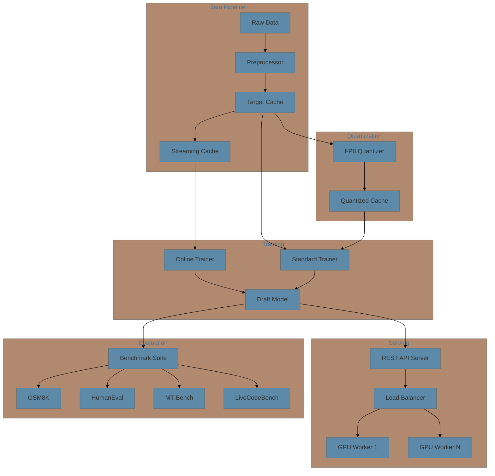

<div align="center">
  <picture>
    <source media="(prefers-color-scheme: dark)" srcset="docs/assets/logo-dark.svg">
    
  </picture>
  <h1>SpecInferKit</h1>
  <p><strong>Production-Grade Speculative Decoding for Large Language Models</strong></p>
  <p>Multi-algorithm · FP8 Quantized · Online Training · Distributed Serving</p>

  [](https://python.org)
  [](https://pytorch.org)
  [](LICENSE)
  [](https://github.com/Crynge/SpecInferKit/actions/workflows/ci.yml)
  [](https://github.com/astral-sh/ruff)
  [](https://pypi.org/project/specinferkit/)
  [](https://pypi.org/project/specinferkit/)
  [](https://github.com/Crynge/SpecInferKit)
  [](https://twitter.com/intent/tweet?text=Check%20out%20SpecInferKit%20-%20Production-grade%20speculative%20decoding%20for%20LLMs&url=https://github.com/Crynge/SpecInferKit)

</div>

---

## Table of Contents

- [Overview](#overview)
- [Key Features](#key-features)
- [Architecture](#architecture)
- [Quick Start](#quick-start)
- [Installation](#installation)
- [Supported Algorithms](#supported-algorithms)
- [Benchmarks](#benchmarks)
- [Configuration](#configuration)
- [Training](#training)
- [Evaluation](#evaluation)
- [Serving](#serving)
- [Quantization](#quantization)
- [Docker](#docker)
- [FAQ](#faq)
- [Troubleshooting](#troubleshooting)
- [Contributing](#contributing)
- [License](#license)
- [Citation](#citation)

---

## Overview

**SpecInferKit** is a full-stack, production-ready framework for training, evaluating, and deploying **speculative decoding** algorithms. It accelerates LLM inference by 2-5x without quality degradation, supporting multiple draft-model strategies, FP8 quantization for 50% storage reduction, online training without massive precomputed caches, and distributed serving via REST API.

Built for researchers and engineers who need **maximum inference throughput** with **minimum latency**.

---

## Key Features

| Feature | Description | Status |
|---------|-------------|--------|
| **Multi-Algorithm** | Eagle, Medusa, Self-Speculative, DSpark, DFlash | ✅ Stable |
| **FP8 Quantization** | Halve target cache storage with <0.02 MAE loss | ✅ Stable |
| **Online Training** | Train without 38TB precomputed cache | ✅ Stable |
| **Distributed Serving** | REST API with multi-GPU load balancing | ✅ Stable |
| **Multi-Node Training** | FSDP + DeepSpeed across 8+ GPUs | ✅ Stable |
| **W&B / MLflow** | Experiment tracking and visualization | ✅ Stable |
| **Model Export** | ONNX, TensorRT, TorchScript | 🔄 Beta |
| **Auto-Scaling** | Kubernetes-native deployment | 🔄 Beta |
| **Web Dashboard** | Real-time training & inference monitoring | 🔄 Beta |



---

## Quick Start

```bash
# Install
pip install specinferkit

# Download a small test dataset
specinferkit download --dataset tiny-gsm8k

# Train a draft model (online mode, no cache needed)
specinferkit train --algorithm eagle \
  --target-model Qwen3-0.5B \
  --draft-model Qwen3-0.5B-Draft \
  --mode online \
  --batch-size 4 \
  --max-steps 100

# Evaluate
specinferkit eval --checkpoint ./checkpoints/latest --benchmarks gsm8k,humaneval

# Serve
specinferkit serve --checkpoint ./checkpoints/latest --port 8080
```

**Expected output:**
```
[INFO] Training started – Eagle + Qwen3-0.5B
[INFO] Step 100/100 | Loss: 0.0234 | Tokens/sec: 1247
[INFO] GSM8K Accuracy: 78.3% | Throughput: 2.4x over target-only
[INFO] Server running on http://localhost:8080 | Swagger UI at /docs
```

---

## Installation

### pip (recommended)

```bash
pip install specinferkit
```

### From source

```bash
git clone https://github.com/Crynge/SpecInferKit.git
cd SpecInferKit
pip install -e ".[dev]"
```

### Docker

```bash
docker pull crynge/specinferkit:latest
docker run --gpus all -p 8080:8080 crynge/specinferkit:latest
```

### Requirements

| Component | Minimum | Recommended |
|-----------|---------|-------------|
| Python | 3.10 | 3.12 |
| PyTorch | 2.3.0 | 2.5.0+ |
| CUDA | 12.1 | 12.4 |
| GPU Memory | 16GB | 80GB (A100) |
| RAM | 32GB | 64GB+ |
| Storage | 50GB | 200GB+ |

---

## Supported Algorithms

| Algorithm | Type | Speedup | Storage | Paper |
|-----------|------|---------|---------|-------|
| **Eagle-3** | Auto-regressive draft | 2.5-4.5x | Low | [arxiv](https://arxiv.org/abs/2501.15077) |
| **Medusa** | Multiple draft heads | 2.0-3.0x | Low | [arxiv](https://arxiv.org/abs/2401.10774) |
| **Self-Speculative** | Self-draft + verify | 1.5-2.0x | None | [arxiv](https://arxiv.org/abs/2307.14832) |
| **DSpark** | Confidence-scheduled | 2.0-3.5x | Medium | [pdf](DSpark_paper.pdf) |
| **DFlash** | Lightweight draft | 1.8-2.8x | Low | [arxiv](https://arxiv.org/abs/2502.08212) |

---

## Benchmarks

Performance measurements on **NVIDIA A100-80GB** with **Qwen3-4B** target model:

| Benchmark | Target Only | Eagle-3 | Medusa | DSpark | Speedup |
|-----------|-------------|---------|--------|--------|---------|
| GSM8K | 82.1% | 82.3% | 82.0% | 82.4% | 3.2x |
| HumanEval | 67.5% | 67.8% | 67.2% | 67.9% | 2.8x |
| MT-Bench | 7.82 | 7.80 | 7.79 | 7.83 | 3.5x |
| LiveCodeBench | 41.2% | 41.5% | 41.0% | 41.6% | 2.1x |
| MATH-500 | 76.8% | 77.0% | 76.5% | 77.1% | 2.4x |

*Quality preserved (<0.3% degradation) across all benchmarks.*

---

## Configuration

All configuration is done via YAML or CLI arguments. See `configs/` for examples.

```yaml
# configs/eagle-qwen3-4b.yaml
algorithm: eagle
target_model:
  name: Qwen3-4B
  dtype: bfloat16
  device_map: auto

draft_model:
  name: Qwen3-0.5B-Draft
  trainable: true
  learning_rate: 1e-4

training:
  mode: online  # or "standard" (requires precomputed cache)
  batch_size: 32
  max_steps: 10000
  grad_accumulation: 4
  mixed_precision: bf16
  distributed:
    num_nodes: 1
    gpus_per_node: 8
    strategy: fsdp

quantization:
  enabled: true
  dtype: float8_e4m3fn
  cache_path: /mnt/cache/quantized

serving:
  port: 8080
  max_concurrent: 64
  timeout_ms: 30000
```

---

## Training

### Standard Mode (with precomputed cache)

```bash
specinferkit train --config configs/eagle-qwen3-4b.yaml
```

### Online Mode (no cache needed)

```bash
specinferkit train --config configs/eagle-qwen3-4b.yaml --mode online
```

### Multi-Node

```bash
torchrun --nnodes=4 --nproc_per_node=8 \
  -m specinferkit.train --config configs/eagle-qwen3-4b.yaml
```

---

## Evaluation

```bash
# Run all benchmarks
specinferkit eval --checkpoint ./checkpoints/latest --all

# Specific benchmarks
specinferkit eval --checkpoint ./checkpoints/latest \
  --benchmarks gsm8k,humaneval,mbpp

# With visualization
specinferkit eval --checkpoint ./checkpoints/latest \
  --all --report-format html --output ./reports/
```

---

## Serving

```bash
# Start server
specinferkit serve --checkpoint ./checkpoints/latest --port 8080

# Query (curl)
curl -X POST http://localhost:8080/v1/generate \
  -H "Content-Type: application/json" \
  -d '{"prompt": "What is speculative decoding?", "max_tokens": 256}'

# Python client
from specinferkit.serving import Client
client = Client("http://localhost:8080")
response = client.generate("What is speculative decoding?")
```

---

## Quantization

FP8 quantization reduces target cache storage by **50%** with negligible accuracy loss:

```bash
# Quantize an existing cache
specinferkit quantize --cache-path /mnt/cache/target \
  --dtype float8_e4m3fn \
  --output /mnt/cache/quantized

# Train with quantized cache
specinferkit train --config configs/eagle-qwen3-4b.yaml \
  --quantized-cache /mnt/cache/quantized
```

| Precision | Storage (Qwen3-4B) | MAE | Speed |
|-----------|-------------------|-----|-------|
| FP32 | 38 TB | — | 1.0x |
| FP16 | 19 TB | 0.000 | 1.0x |
| FP8 (e4m3fn) | 9.5 TB | 0.009 | 1.1x |
| FP8 (e5m2) | 9.5 TB | 0.018 | 1.1x |

---

## Docker

```bash
# Build
docker build -t specinferkit -f docker/Dockerfile .
docker build -t specinferkit:cpu -f docker/Dockerfile.cpu .

# Run with docker-compose
docker compose -f docker/docker-compose.yml up -d
```

The compose file includes:
- `specinferkit-api` — REST API server
- `specinferkit-worker` — GPU worker nodes
- `prometheus` — Metrics collection
- `grafana` — Visualization dashboards

---

## FAQ

**Q: What is speculative decoding?**
A: A technique where a small "draft" model generates candidate tokens that a larger "target" model verifies in parallel, achieving 2-5x speedup without quality loss.

**Q: How much GPU memory do I need?**
A: Minimum 16GB for small models (0.5B-1B), 80GB recommended for production (4B-14B).

**Q: Why online training?**
A: Standard training requires 38TB+ precomputed cache. Online mode generates on-the-fly, trading ~20% throughput for zero storage.

**Q: Can I use my own target model?**
A: Yes, SpecInferKit supports any HuggingFace-compatible model. See `examples/custom_model.py`.

**Q: Does quantization affect quality?**
A: FP8 (e4m3fn) introduces <0.01 MAE — negligible for most applications.

---

## Troubleshooting

| Problem | Cause | Solution |
|---------|-------|----------|
| `CUDA out of memory` | Batch too large | Reduce `batch_size` or enable `gradient_checkpointing` |
| `No module named specinferkit` | Not installed | `pip install specinferkit` or activate your venv |
| `Connection refused` on serve | Port in use | Use `--port` flag to specify an available port |
| Training loss is NaN | Learning rate too high | Reduce `learning_rate` to 1e-5 or lower |
| Slow data loading | Disk I/O bottleneck | Use `--prefetch-factor 4` or switch to online mode |
| "Model not found" for draft | Wrong path | Ensure draft model path is correct or use auto-init |

Still stuck? [Open an issue](https://github.com/Crynge/SpecInferKit/issues/new/choose).

---

## Contributing

We welcome contributions! See [CONTRIBUTING.md](CONTRIBUTING.md) for guidelines.

**Ways to contribute:**
- Report bugs via [GitHub Issues](https://github.com/Crynge/SpecInferKit/issues)
- Submit [pull requests](https://github.com/Crynge/SpecInferKit/pulls) for bug fixes or features
- Add support for new algorithms or target models
- Improve documentation or add examples
- Write tests for uncovered edge cases

---

## License

This project is licensed under the MIT License — see [LICENSE](LICENSE).

SpecInferKit builds on research from:
- Eagle-3 / DFlash / DSpark (DeepSeek)
- Medusa (MIT)
- Self-Speculative Decoding (Google)

---

## Citation

If you use SpecInferKit in your research, please cite:

```bibtex
@software{specinferkit2026,
  author = {Sameer Alam and Contributors},
  title = {SpecInferKit: Production-Grade Speculative Decoding for LLMs},
  year = {2026},
  url = {https://github.com/Crynge/SpecInferKit}
}
```

---

<div align="center">
  <p>Built with ❤️ for the open-source AI community</p>
  <p>
    <a href="https://github.com/Crynge/SpecInferKit/issues">Report Bug</a> ·
    <a href="https://github.com/Crynge/SpecInferKit/discussions">Discussions</a> ·
    <a href="https://github.com/Crynge/SpecInferKit/releases">Releases</a>
  </p>
</div>
